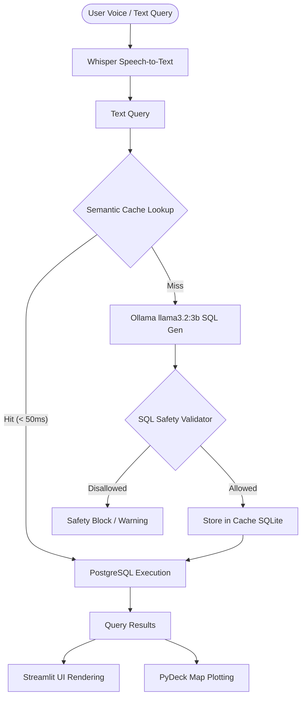

# Voice-to-SQL Application Guide

Welcome to the comprehensive guide for the Voice-to-SQL Dashboard and API. This system allows you to ask database questions in plain English (via typing or microphone speech) and automatically translates, validates, and runs secure PostgreSQL queries in-process or over REST.

---

## 1. System Architecture & Data Flow

The application runs **100% locally** offline on your device, ensuring privacy and sub-second response times.



### Key Stages:
1. **Speech-to-Text (STT)**: Uses `faster-whisper` to transcribe voice input from your microphone.
2. **Semantic Cache Lookup**: Before calling the local LLM, a cosine-similarity search runs on local SQLite embeddings to check for matching previous questions. A hit returns the query in **under 50ms**.
3. **SQL Generation**: Generates PostgreSQL syntax using the local `llama3.2:3b` model.
4. **Safety Filter**: Scans generated SQL to block commands like `DROP`, `DELETE`, `UPDATE`, or `INSERT`.
5. **Geospatial Mapping**: Renders alert locations using PyDeck if coordinates are present in the SQL output.

---

## 2. Database Schema & Spatial Mappings

The system operates on three tables inside the PostgreSQL `city_alerte` database:

| Table | Column Name | Type | Key / Constraint | Description |
| :--- | :--- | :--- | :--- | :--- |
| **cities** | `city_id` | INTEGER | PRIMARY KEY | Unique identifier for each city. |
| | `city_name` | VARCHAR | UNIQUE | Name of the city (e.g. 'Mumbai', 'Delhi'). |
| | `state` | VARCHAR | | State code or name. |
| | `boundary_lat_min` | NUMERIC | | Southern bounding box edge. |
| | `boundary_lat_max` | NUMERIC | | Northern bounding box edge. |
| | `boundary_lon_min` | NUMERIC | | Western bounding box edge. |
| | `boundary_lon_max` | NUMERIC | | Eastern bounding box edge. |
| **alerts** | `alert_id` | INTEGER | PRIMARY KEY | Unique identifier for each alert. |
| | `alert_type` | VARCHAR | | Type (`HIGH_TEMP`, `HIGH_HUMIDITY`, etc.) |
| | `severity` | VARCHAR | | Severity (`LOW`, `MEDIUM`, `HIGH`, `CRITICAL`) |
| | `detected_at` | TIMESTAMP | | Time alert was registered. |
| **alert_readings**| `reading_id` | INTEGER | PRIMARY KEY | Unique identifier for sensor reading. |
| | `alert_id` | INTEGER | FOREIGN KEY | Links to `alerts(alert_id)`. |
| | `latitude` | NUMERIC | | Sensor coordinate latitude. |
| | `longitude` | NUMERIC | | Sensor coordinate longitude. |
| | `temperature` | NUMERIC | | Temperature measurement in °C. |
| | `humidity` | NUMERIC | | Humidity measurement in %. |
| | `bandwidth` | NUMERIC | | Active network bandwidth value. |

### The Spatial Join Concept
There is no direct foreign key relation or matching ID column linking `alerts` or `alert_readings` to a specific city. Instead, alert locations are mapped to cities dynamically using a **spatial boundary join**:
```sql
SELECT c.city_name, a.alert_id, r.temperature
FROM alerts a
JOIN alert_readings r ON a.alert_id = r.alert_id
LEFT JOIN cities c ON r.latitude BETWEEN c.boundary_lat_min AND c.boundary_lat_max
                  AND r.longitude BETWEEN c.boundary_lon_min AND c.boundary_lon_max;
```

---

## 3. Security & SQL Safety Rules

To prevent accidental updates or database tampering, the system checks all generated queries against a strict safety blacklist:

> [!WARNING]
> Only read-only requests (`SELECT` and `WITH` statements) are allowed.
> The validator immediately blocks execution if any of the following keywords are detected:
> - `DELETE`, `UPDATE`, `INSERT`, `DROP`, `ALTER`, `TRUNCATE`, `CREATE`, `REPLACE`, `MERGE`, `EXEC`, `EXECUTE`, `CALL`, `COPY`

---

## 4. Local Deployment & Setup Guide

### System Prerequisites
Ensure you have the following services installed and running on your machine:
* **PostgreSQL**: Serving database `city_alerte` on port `5432`.
* **Ollama**: Service active on port `11434` with model `llama3.2:3b` pulled (`ollama pull llama3.2:3b`).
* **PortAudio**: System library required for recording audio (e.g. `brew install portaudio` on macOS).

### Local Execution (NPM Scripts)
Install dependencies and run the dashboard and server:
```bash
# Install dependencies
npm install

# Start the Streamlit Dashboard (Access at http://localhost:8502)
npm run dev

# Start the FastAPI REST API (Access at http://localhost:8000)
npm run api
```

### Containerized Execution (Docker Compose)
If you prefer Docker, you can spin up the PostgreSQL database and app services in one go:
```bash
docker-compose up --build
```
* **Dashboard**: Running at `http://localhost:8502`
* **FastAPI Server**: Running at `http://localhost:8000`
* *Note: The containers automatically link to your host machine's Ollama instance using `host.docker.internal`.*

---

## 5. Programming Integration Guide

You can install the package globally in your environment in editable mode to write custom Python scripts that leverage the in-process Voice-to-SQL logic:

```bash
pip install -e .
```

### In-Process Script Example
```python
import voicetosqldatabase as vts

# Query the PostgreSQL database in-process
result = vts.run_nl_query("Show me all critical temp alerts in Jaipur")

print("Generated SQL Query:")
print(result["sql"])

print("\nData returned:")
for row in result["rows"]:
    print(row)
```
